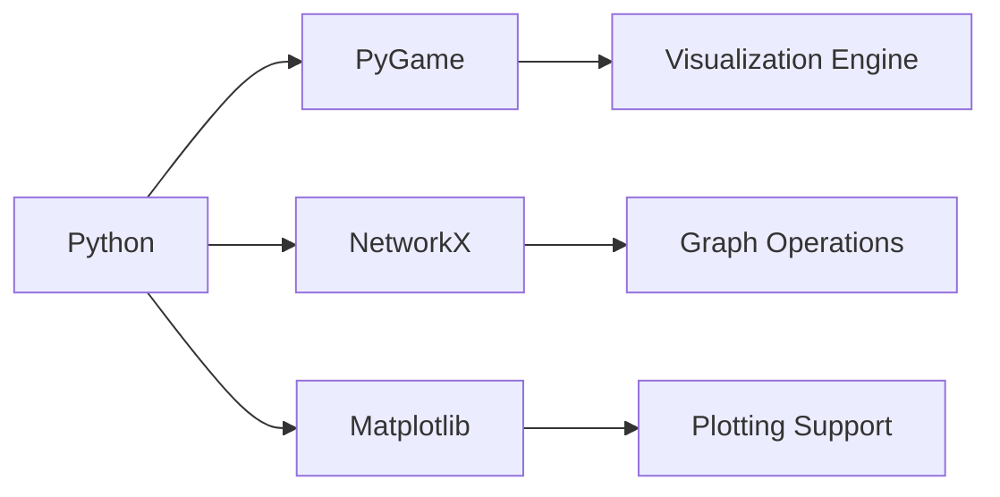

Understanding graph algorithms can be challenging due to their abstract nature. To make these concepts more intuitive, I developed an interactive visualizer that demonstrates how pathfinding algorithms explore graphs in real-time.

## Why Visualize Graph Algorithms?

Graph algorithms are fundamental in various applications:
- **Navigation systems** (Google Maps, Waze)
- **Network routing** (Internet traffic optimization)
- **Game AI** (NPC pathfinding)
- **Social network analysis** (Friend recommendations)

Visualization provides several benefits:
- **Enhanced Learning** – See algorithms in action.
- **Debugging Aid** – Identify implementation issues visually.
- **Performance Optimization** – Compare algorithm efficiency dynamically.

## Tech Stack



## Core Features

### 1. Interactive Graph Creation
   - Click to place nodes.
   - Drag to create edges.
   - Adjust edge weights dynamically.

### 2. Algorithm Visualization
   - Dijkstra's Algorithm
   - A* Search
   - Breadth-First Search (BFS)
   - Depth-First Search (DFS)

### 3. Real-Time Visual Cues
   - Color-coded node states (visited, frontier, path).
   - Dynamic distance updates.
   - Adjustable animation controls.

## Implementation Highlights

### Dijkstra’s Algorithm Implementation

```python
import heapq
from typing import Dict, List, Tuple

def dijkstra(graph: Dict[int, List[Tuple[int, int]]], start: int) -> Dict[int, int]:
    distances = {node: float('inf') for node in graph}
    distances[start] = 0
    heap = [(0, start)]
    visited = set()
    
    while heap:
        current_dist, current_node = heapq.heappop(heap)
        
        if current_node in visited:
            continue
            
        visited.add(current_node)
        visualize_current_node(current_node)  # Visualization hook
        
        for neighbor, weight in graph[current_node]:
            distance = current_dist + weight
            
            if distance < distances[neighbor]:
                distances[neighbor] = distance
                heapq.heappush(heap, (distance, neighbor))
                visualize_relaxation(neighbor, distance)  # Visualization hook
                
    return distances
```

### Visualization Engine Using PyGame

```python
import pygame

class GraphVisualizer:
    def __init__(self, width=800, height=600):
        pygame.init()
        self.screen = pygame.display.set_mode((width, height))
        self.clock = pygame.time.Clock()
        
    def draw_node(self, node, color, radius=20):
        pygame.draw.circle(self.screen, color, node.position, radius)
        
    def draw_edge(self, start, end, weight, color):
        pygame.draw.line(self.screen, color, start.position, end.position, 2)
        
    def update_display(self):
        pygame.display.flip()
        self.clock.tick(60)
```

## Key Challenges and Solutions

### 1. Performance Optimization for Large Graphs
- Implemented **quad-tree spatial partitioning** for faster rendering.
- Added **level-of-detail (LoD) rendering** to improve responsiveness.
- Provided **algorithm speed controls** for smoother animations.

### 2. Enhancing User Interaction
- Implemented **context-sensitive controls** for intuitive editing.
- Added **undo/redo functionality** for better experimentation.
- Designed **touch support** for tablet users.

### 3. Improving Educational Value
- **Step-by-step execution mode** for deeper understanding.
- **Algorithm comparison view** to visualize efficiency differences.
- **Synchronized pseudocode display** to reinforce learning.

## Educational Applications

This visualizer has been utilized in:
- University **computer science courses**.
- **Coding bootcamps** for algorithm training.
- **Technical interview preparation**.
- **Game development workshops** for AI pathfinding.

## Future Enhancements

### 1. Expanding Algorithm Support
- Bellman-Ford Algorithm
- Floyd-Warshall Algorithm
- Minimum Spanning Tree (Prim’s & Kruskal’s)

### 2. Advanced Visualization Features
- **3D graph rendering** for more immersive interaction.
- **Parallel algorithm visualization** to analyze performance.
- **Machine learning integration** for smart pathfinding.

### 3. Collaboration and Sharing
- **Multi-user graph editing** in real-time.
- **Cloud-based project sharing**.
- **Version history tracking** for learning progression.

## Conclusion

Developing this visualizer has deepened my understanding of graph algorithms while creating a valuable educational tool. The project showcases how visualization enhances learning, debugging, and algorithm analysis.

Try it out on [GitHub](https://github.com/MohamedxOU), and let me know what algorithms you'd like to see added next!

